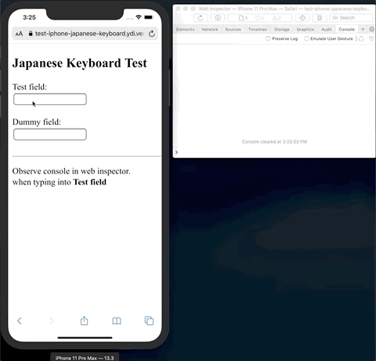

## Simple HTML page to test issue with Japanese keyboard in iPhone

The Romaji Japanese keyboard in iPhone exhibits odd behavior that can be demonstrated by the HTML page in public folder of this repo.

### How to test

In order to serve the html tester page - run:
```
$ npm start
```

The page can be accessed at: http://127.0.0.1:8080/

Or you can try the public deployed version at:
https://test-iphone-japanese-keyboard.ydi.vercel.app/


#### Setup XCode simulator

1. Open XCode
2. Launch the simulator via XCode => Open Developer Tool => Simulator
3. In the simulator iPhone settings in General => Keyboards - add Japanese Romaji keyboard.
4. Set the iPhone language to Japanese in General => Language & Region => iPhone Language.
5. Open Safari in the simulator and navigate to any of the urls mentioned above.
6. In Mac open Safari and ensure you have the develop menu in the menubar.
7. Open Mac Safari Web Inspector by going to: Develop => Simulator => Safari => the test page url.
8. Open the console in the web inspector to observe the log.

#### Test

1. Focus on the `Test field`
2. When keyboard popup select the Japanese keyboard.
3. Enter some characters and observe log in console.
4. Focus on `Dummy field` to invoke blur event.
5. Switch to English keyboard and repeat the test and see the behavior.

#### The bug

The bug is demonstrated with the Japanese keyboard

- It seems to hold on focus to the first input field the user types to.
- The characters are highlighted (selected) while typing.
- When focusing on the `Dummy field` the focus is not shifting and is still on the `Test Field`.
- The order of events in the console log shows an unexpected `focus` event after the expected `blur` event.

```
[Log] on-focus – ""
[Log] on-change – "123"
[Log] on-blur – "123"
[Log] on-focus – "123"
```


#### Expectation

As demonstrated by the English keyboard.

- Focus is not sticky to the first input field.
- Chracters in the input field are not highlighted (selected).
- Focus is shifting immediately and is reponssive.
- The order of events in the console log is as expected ended with `blur` event when focus on `Dummy field`.

```
[Log] on-focus – ""
[Log] on-change – "123"
[Log] on-blur – "123"
```


